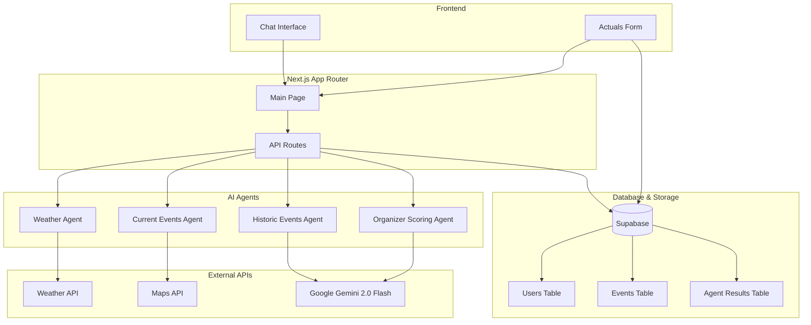

# Community Event Impact Predictor

An AI-powered Next.js application that predicts the success and impact of community events using modular AI agents and real-time data analysis.

## 🏗️ Architecture



## 🚀 Features

- **Modular AI Agents**: Weather, Current Events, Historical Analysis, and Organizer Scoring
- **Real-time Chat Interface**: Interactive event planning assistance
- **Comprehensive Analysis**: Weather conditions, competing events, historical patterns
- **Readiness Scoring**: AI-powered success probability assessment
- **Feedback Loop**: Post-event actuals collection for model improvement
- **Real-time Updates**: Supabase real-time subscriptions

## 🛠️ Tech Stack

- **Frontend**: Next.js 14+ with App Router, React 19, TypeScript
- **Styling**: Tailwind CSS v4.0 with Forms plugin
- **Database**: Supabase (PostgreSQL with RLS)
- **AI**: Google Gemini 2.0 Flash
- **Package Manager**: pnpm

## 📋 Prerequisites

- Node.js 18+ 
- pnpm package manager
- Supabase account
- Google Gemini API key
- Maps API key (Google Maps)

## 🔧 Installation

### 1. Clone and Install Dependencies

```powershell
cd D:\Projects\hophacks-project
pnpm install
```

### 2. Environment Configuration

Create a `.env` file in the root directory:

```env
# Supabase Configuration
SUPABASE_URL=your_supabase_url_here
SUPABASE_KEY=your_supabase_anon_key_here

# AI API Keys
GEMINI_API_KEY=your_gemini_api_key_here

# External API Keys
MAPS_API_KEY=your_maps_api_key_here
```

### 3. Database Setup

Run the SQL schema in your Supabase dashboard:

```sql
-- See supabase/schema.sql for complete schema
-- This creates users, events, and agent_results tables with RLS policies
```

### 4. Development Server

```powershell
pnpm dev
```

The application will be available at `http://localhost:3000`.

## 📊 Usage

### 1. Event Analysis

Describe your event in natural language:

```
"I'm planning a community festival in Central Park on 2024-06-15 for 500 people with a $15,000 budget"
```

### 2. AI Agent Analysis

The system will automatically run four agents:

- **Weather Agent**: Analyzes weather conditions and provides recommendations
- **Current Events Agent**: Identifies competing events and traffic conditions
- **Historic Events Agent**: Analyzes historical patterns and success factors
- **Organizer Scoring Agent**: Provides comprehensive readiness score and recommendations

### 3. Post-Event Feedback

After your event, use the "Submit Actual Results" button to provide:

- Actual attendance numbers
- Actual costs and revenue
- Weather conditions experienced
- Issues encountered
- Additional notes

This data improves future predictions through the feedback loop.

## 🔒 Security Features

- **Row Level Security (RLS)**: Users can only access their own data
- **API Key Protection**: Server-side only API key usage
- **Input Validation**: Comprehensive payload validation
- **Error Handling**: Graceful error handling and user feedback

## 📈 Performance Optimizations

- **Parallel Agent Execution**: All agents run concurrently
- **Retry Logic**: 3-attempt retry with exponential backoff
- **Timeout Handling**: 10-15 second timeouts for external calls
- **Database Indexing**: Optimized queries with proper indexes
- **Real-time Subscriptions**: Efficient data updates

## 🧩 Agent Details

### Weather Agent
- Fetches weather forecasts from OpenWeatherMap
- Analyzes temperature, humidity, and conditions
- Provides specific recommendations based on weather

### Current Events Agent
- Identifies competing events in the area
- Analyzes traffic and maps conditions
- Assesses parking availability

### Historic Events Agent
- Analyzes historical event data patterns
- Uses LLM to identify success factors
- Provides attendance predictions based on history

### Organizer Scoring Agent
- Aggregates all agent outputs
- Computes comprehensive readiness score (0-100)
- Provides actionable recommendations and risk assessment

## 📝 API Documentation

### POST /api/agent

Execute an AI agent with the specified payload.

**Request Body:**
```json
{
  "agent": "weather|currentEvents|historicEvents|organizerScoring",
  "payload": {
    "location": "string",
    "date": "string",
    "eventType": "string",
    "expectedAttendance": "number",
    "budget": "number"
  },
  "eventId": "string (optional)",
  "userId": "string (optional)"
}
```

**Response:**
```json
{
  "success": true,
  "agent": "string",
  "result": "string",
  "timestamp": "string"
}
```

## 🚀 Deployment

### Build for Production

```powershell
pnpm build
```

### Start Production Server

```powershell
pnpm start
```

### Environment Variables for Production

Ensure all environment variables are set in your production environment:

- `SUPABASE_URL`
- `SUPABASE_KEY`
- `GEMINI_API_KEY`
- `MAPS_API_KEY`

## 📄 License

This project is licensed under the MIT License.
